# Next Legend Data Model

This document describes the PostgreSQL serving model used by the API, frontend, and pipeline.

## Ownership

- Pipeline-owned football data: dimensions, player-season facts, metrics, scoring, percentiles, similarity, pipeline runs.
- API-owned application data: auth, prospects, club needs, AI history, HQ/HD workspace, transfer history, CRM.
- Frontend-owned data: none. The frontend must consume API state and must not persist business state directly.

## Mermaid ER Diagram

```mermaid
erDiagram
  competitions ||--o{ player_seasons : competition_id
  seasons ||--o{ player_seasons : season_id
  clubs ||--o{ player_seasons : club_id
  players ||--o{ player_seasons : player_id

  player_seasons ||--|| player_metrics : player_season_id
  player_seasons ||--o{ role_scores : player_season_id
  player_seasons ||--o{ player_metric_percentiles_global : player_season_id
  player_seasons ||--o{ player_metric_percentiles_league : player_season_id
  player_seasons ||--o{ player_similarity : player_a_season_id
  player_seasons ||--o{ player_similarity : player_b_season_id
  seasons ||--o{ scoring_snapshot_runs : season_id
  scoring_snapshot_runs ||--o{ player_score_snapshots : snapshot_run_id
  player_seasons ||--o{ player_score_snapshots : player_season_id
  player_score_snapshots ||--o{ player_metric_snapshots : score_snapshot_id

  transfermarkt_players ||--o{ transfermarkt_market_value_snapshots : tm_player_id
  players ||--o{ player_transfermarkt_matches : player_id
  transfermarkt_players ||--o{ player_transfermarkt_matches : tm_player_id
  players ||--o{ prospects : player_id
  clubs ||--o{ club_needs : club_id
  club_needs ||--o{ club_need_players : club_need_id
  player_seasons ||--o{ club_need_players : player_season_id

  auth_users ||--o{ auth_sessions : user_id
  auth_users ||--o{ ai_conversations : user_id
  ai_conversations ||--o{ ai_messages : conversation_id
  auth_users ||--o{ hq_priority_items : created_by_agent_id
  auth_users ||--o{ hd_players : created_by_agent_id
  hd_players ||--o{ hd_player_documents : hd_player_id
  players ||--o{ hd_players : player_id
  players ||--o{ player_transfer_history : linked_player_id

  auth_users ||--o{ mercato_requests : created_by_agent_id
  auth_users ||--o{ mercato_requests : assigned_agent_id
  mercato_requests ||--o{ mercato_needs : request_id
  mercato_needs ||--o{ mercato_candidates : need_id
  mercato_candidates ||--o{ mercato_candidate_events : candidate_id

  crm_clubs ||--o{ crm_players : club_id
  crm_clubs ||--o{ crm_contacts : club_id
  crm_players ||--o{ crm_contacts : player_id
  crm_contacts ||--o{ crm_prospects : contact_id
```



## Core Football Tables

### `competitions`

Competition dimension.

Important fields:
- `id`
- `name`
- country/level fields when available

Owned by: pipeline.

### `seasons`

Season dimension.

Important fields:
- `id`
- `calendar`

Owned by: pipeline.

### `clubs`

Club dimension used by scouting data, not the CRM.

Important fields:
- `id`
- `name`
- logo/reference fields when available

Owned by: pipeline.

### `players`

Player identity dimension.

Important fields:
- `id`
- Wyscout identity
- display name
- `tm_id`
- `tm_profile_url`

Owned by: pipeline.

Transfermarkt identity rule:
- `tm_id` and `tm_profile_url` are compatibility fields populated from accepted `player_transfermarkt_matches`.
- Do not treat them as the full matching audit trail.

### `player_seasons`

Central fact table. One row represents a player in one club, competition, and season context.

Effective natural key:

```text
player_id + competition_id + season_id + club_id
```

Important fields:
- `player_id`
- `club_id`
- `competition_id`
- `season_id`
- `position`
- `age`
- `minutes_played`
- `matches_played`
- `team_in_selected_period`
- `assigned_role`
- `global_score_adjusted`
- `assigned_role_pct_global`
- `assigned_role_pct_league`
- Transfermarkt `tm_*` fields

Scoring v2 compatibility:
- `assigned_role` stores the v2 position group display name, not a tactical role.
- `global_score_adjusted` stores the final Next Legend score.
- `assigned_role_pct_global` mirrors the visible final score for legacy consumers.
- `assigned_role_pct_league` stores same-league/same-season score context.

Owned by: pipeline.

Transfermarkt compatibility rule:
- dynamic `tm_*` fields are still exposed to API/frontend consumers;
- monthly refreshes should update them only from accepted primary rows in `player_transfermarkt_matches`;
- market-value history belongs in `transfermarkt_market_value_snapshots`, not only in `player_seasons`.

### `transfermarkt_players`

Transfermarkt identity dimension keyed by `tm_player_id`.

Important fields:
- `tm_player_id`
- `name`
- `profile_url`
- `profile_image_url`
- `birth_date`
- `age`
- `club_id`
- `club_name`
- `position_main`
- `citizenship`
- `agent_name`
- `market_value_eur`
- `raw_payload`
- `fetched_at`

Owned by: pipeline.

### `transfermarkt_market_value_snapshots`

Monthly market-value snapshots.

Effective natural key:

```text
tm_player_id + snapshot_date
```

Important fields:
- `snapshot_date`
- `market_value_eur`
- `market_value_label`
- `club_id`
- `club_name`
- `source`
- `raw_payload`

Owned by: pipeline.

### `player_transfermarkt_matches`

Auditable Wyscout to Transfermarkt matching decisions.

Effective natural key:

```text
player_id + tm_player_id
```

Important fields:
- `confidence_score`
- `score_margin`
- `method`
- `status`
- `is_primary`
- `evidence`

Rules:
- only `status = accepted` and `is_primary = true` rows update visible Transfermarkt fields;
- ambiguous candidates must stay in `review`;
- one primary Transfermarkt link is allowed per Wyscout player.

Owned by: pipeline.

### `player_metrics`

Metrics table keyed by `player_season_id`.

Purpose:
- clean Wyscout raw metrics;
- compact v2 scoring breakdown;
- report raw values.

Rules:
- do not store metric percentile explosion columns here;
- do not store stale role-score columns;
- keep totals and per-90 metrics distinct, for example `xg` vs `xg_per_90`;
- keep snake_case metric names;
- missing data is `NULL`, never forced to `0`.

The pipeline prunes obsolete metric columns by default with:

```text
PIPELINE_PRUNE_METRIC_COLUMNS=1
```

Owned by: pipeline.

### `role_scores`

Legacy table name kept for API compatibility.

In scoring v2:
- `profile` is the position group;
- one row exists per player-season when the player maps to a position group;
- `pct_global_adjusted` aligns with `player_seasons.global_score_adjusted` for the assigned group.

Owned by: pipeline.

### `player_metric_percentiles_global`

Long-format metric percentiles.

Scope:

```text
same season + same position group + all competitions
```

Key:

```text
player_season_id + metric_key
```

Important fields:
- `player_season_id`
- `season_id`
- `position_group`
- `metric_key`
- `raw_value`
- `percentile`
- `sample_size`
- `lower_is_better`

The report uses this table for global metric context. A goalkeeper is compared only with goalkeepers, a centre forward only with centre forwards, etc.

Owned by: pipeline.

### `player_metric_percentiles_league`

Long-format metric percentiles.

Scope:

```text
same season + same competition + same position group
```

Key:

```text
player_season_id + metric_key
```

Important fields:
- `player_season_id`
- `season_id`
- `competition_id`
- `position_group`
- `metric_key`
- `raw_value`
- `percentile`
- `sample_size`
- `lower_is_better`

Owned by: pipeline.

### `player_similarity`

Top statistical neighbors.

Rules:
- rebuilt by the pipeline;
- max 10 neighbors per source player-season in dev and prod;
- use `PIPELINE_REPLACE_SIMILARITY=1` when regenerating to avoid duplicates.

Owned by: pipeline.

### `pipeline_runs`

Batch run tracking.

Used for:
- home monitoring;
- pipeline status;
- artifact traceability.

Owned by: pipeline.

### `scoring_snapshot_runs`

Snapshot batch header for current-season score tracking.

Purpose:
- identify one scored snapshot period;
- store the scoring model version/hash used for that period;
- keep row counts for auditability.

Default cadence is biweekly. A repeated run in the same cadence bucket updates the same snapshot instead of duplicating it.

Important fields:
- `run_id`
- `snapshot_key`
- `snapshot_date`
- `season_id`
- `season_label`
- `cadence`
- `scoring_model_version`
- `scoring_model_hash`
- `rows_snapshotted`
- `metric_rows_snapshotted`

Owned by: pipeline.

### `player_score_snapshots`

One row per player-season inside a scoring snapshot.

Purpose:
- track score evolution during the current season;
- preserve the score context at the time of the run;
- support later analysis when the scoring model changes.

Important fields:
- `snapshot_run_id`
- `player_season_id`
- `player_id`
- `competition_id`
- `club_id`
- `position`
- `position_group`
- `minutes_played`
- `matches_played`
- `minutes_possible`
- `minutes_ratio`
- `global_score_adjusted`
- `assigned_role_pct_league`
- `assigned_role_pct_global`
- `league_strength_factor`
- `team_strength_z`
- `club_strength_modifier`
- `minutes_regularity_modifier`

Owned by: pipeline.

### `player_metric_snapshots`

Long-format snapshot of the metrics used by the scoring model for each player score snapshot.

Purpose:
- store raw values and percentiles for the important scoring inputs;
- preserve metric weights and families from the active scoring model;
- allow future recalculation/comparison after scoring model changes.

Important fields:
- `score_snapshot_id`
- `metric_key`
- `raw_value`
- `percentile_global`
- `percentile_league`
- `metric_weight`
- `metric_family`
- `lower_is_better`
- `scoring_model_version`

Owned by: pipeline.

## Scouting And Workflow Tables

### `prospects`

Selected player prospects.

Relationship:
- optional link to `players`.

Owned by: API.

### `club_needs`

Recruitment needs for clubs.

Relationship:
- optional/required club context depending on API route;
- linked to candidates through `club_need_players`.

Owned by: API.

### `club_need_players`

Join table between club needs and player-season candidates.

Relationships:
- `club_need_id` -> `club_needs.id`
- `player_season_id` -> `player_seasons.id`

Owned by: API.

## Auth And AI Tables

### `auth_users`

Application users.

Owned by: API.

### `auth_sessions`

HttpOnly session storage.

Relationship:
- `user_id` -> `auth_users.username`

Owned by: API.

### `ai_conversations`

AI conversation header/history.

Owned by: API.

### `ai_messages`

AI conversation messages.

Relationship:
- `conversation_id` -> `ai_conversations.id`

Owned by: API.

## HD Sports Workspace

### `hq_priority_items`

Agency HQ Kanban/calendar priorities.

Owned by: API.

### `hd_players`

Represented HD Sports players and operational notes.

Relationships:
- optional `player_id` -> `players.id`
- created/updated by `auth_users`

Owned by: API.

### `hd_player_documents`

Documents attached to represented players.

Relationship:
- `hd_player_id` -> `hd_players.id`

Owned by: API.

### `player_transfer_history`

Transfer history imported from Wyscout/Transfermarkt-like sources and displayed in player reports/rooms.

Relationships:
- optional `linked_player_id` -> `players.id`

Owned by: API/import tooling.

## Mercato Tables

### `mercato_requests`

Mercato request/workflow header.

Relationships:
- `created_by_agent_id` -> `auth_users.username`
- `assigned_agent_id` -> `auth_users.username`

Owned by: API.

### `mercato_needs`

Needs attached to a mercato request.

Relationship:
- `request_id` -> `mercato_requests.id`

Owned by: API.

### `mercato_candidates`

Candidate players attached to a mercato need.

Relationship:
- `need_id` -> `mercato_needs.id`

Owned by: API.

### `mercato_candidate_events`

Event log for a mercato candidate.

Relationship:
- `candidate_id` -> `mercato_candidates.id`

Owned by: API.

## Network CRM Tables

The CRM model is imported from `findyourlegend` into dedicated `crm_*` tables. It is separate from scouting `clubs`, `players`, and `prospects`.

### `crm_clubs`

Football clubs used by the Network CRM.

Relationships:
- has many `crm_players`;
- has many `crm_contacts`.

Owned by: API/CRM migration.

### `crm_players`

CRM players linked to CRM clubs.

Relationship:
- `club_id` -> `crm_clubs.id`

Owned by: API/CRM migration.

### `crm_contacts`

Central CRM entity.

Relationships:
- optional `club_id` -> `crm_clubs.id`;
- optional `player_id` -> `crm_players.id`;
- has many `crm_prospects`.

Important rule:
- `type = PLAYER` is a category, not proof of a linked CRM player.
- contacts without club/player relation are valid and must remain supported.

Owned by: API/CRM migration.

### `crm_prospects`

CRM prospection pipeline.

Relationship:
- `contact_id` -> `crm_contacts.id`

Stages:
- `prequalification`
- `relance1`
- `relance2`
- `relance3`

Owned by: API/CRM migration.

## Refresh Rules

Weekly/current-season refreshes:
- default to incremental upsert;
- keep historical seasons;
- preserve player-season rows temporarily missing from scraper output;
- do not truncate football tables unless explicitly doing a full rebuild;
- recompute percentiles on a complete current-season slice, not on changed rows only;
- keep similarity top-k at 10.

Incremental persistence rules:
- `player_seasons` natural key is `player_id + competition_id + season_id + club_id`.
- `player_metrics` primary key is `player_season_id`.
- `player_metric_percentiles_global` key is `player_season_id + metric_key`.
- `player_metric_percentiles_league` key is `player_season_id + metric_key`.
- `role_scores` key is `player_season_id + profile`.
- `player_similarity` key is `player_a_season_id + player_b_season_id + profile`.
- Upserts update existing rows only when at least one persisted value is different (`IS DISTINCT FROM`).
- Routine refreshes must not call slice purges; use `PIPELINE_REPLACE_INPUT_SLICES=0`.
- `PIPELINE_REPLACE_TABLES=1` is reserved for explicit full rebuilds.

Data quality and freshness gates run before persistence:
- required raw/fact columns must exist;
- natural keys must be complete and duplicate-free;
- scores must stay in `[50, 99]`;
- expected calendars can be enforced with `DATA_FRESHNESS_EXPECT_CALENDARS`;
- similarity must stay at or below `SIM_TOPK`, normally `10`;
- low club roster counts are logged as warnings because early-season data can be partial.

Production:
- do not run the full raw pipeline on the current VPS;
- use local-compute, then load artifacts or a validated DB dump into PROD;
- always back up PROD before destructive restore.

## Verification Queries

```sql
SELECT
  (SELECT count(*) FROM player_seasons) AS player_seasons,
  (SELECT count(*) FROM player_metrics) AS player_metrics,
  (SELECT count(*) FROM player_metric_percentiles_global) AS metric_pct_global,
  (SELECT count(*) FROM player_metric_percentiles_league) AS metric_pct_league,
  (SELECT count(*) FROM role_scores) AS role_scores,
  (SELECT count(*) FROM player_similarity) AS player_similarity,
  (SELECT count(*) FROM crm_contacts) AS crm_contacts;

SELECT id, run_id, status, rows_processed, source_uri, started_at, ended_at
FROM pipeline_runs
ORDER BY id DESC
LIMIT 5;

SELECT position_group, metric_key, count(*) AS rows, max(sample_size) AS sample_size
FROM player_metric_percentiles_global
GROUP BY position_group, metric_key
ORDER BY position_group, rows DESC
LIMIT 50;
```

Expected invariants:
- `player_seasons`, `player_metrics`, `player_metric_percentiles_global`, `player_metric_percentiles_league`, and `role_scores` are non-empty after a successful scoring load.
- `player_similarity` has at most 10 rows per source player-season.
- `pipeline_runs.message` includes a `data_quality` report for each successful ingestion.
- `crm_contacts` remains non-empty after CRM migration or DEV-to-PROD DB promotion.
- API endpoints requiring auth return `401` without `nl_session`.
